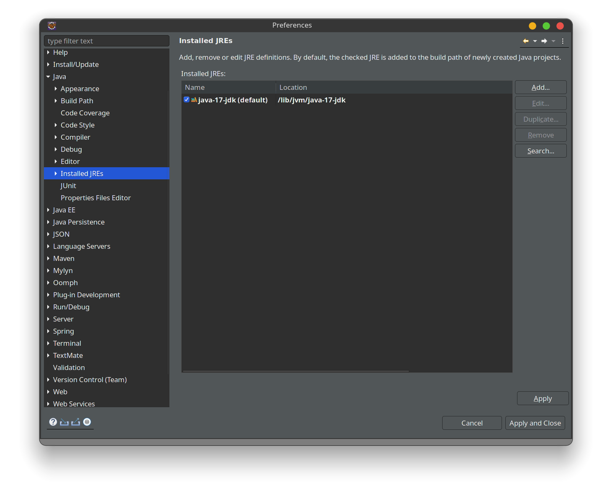
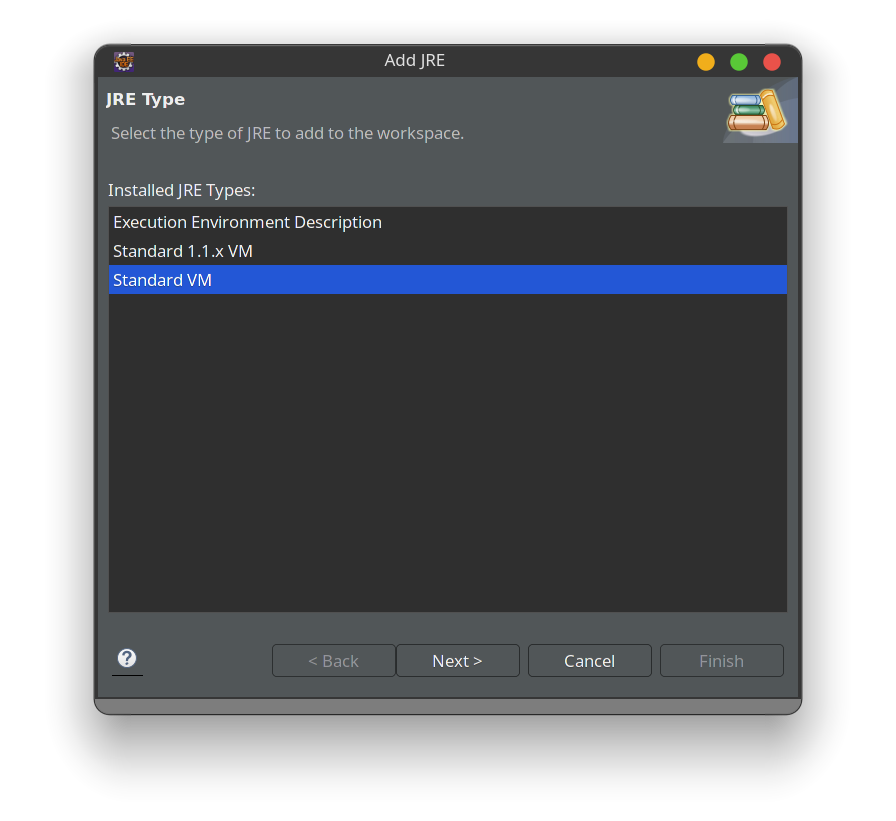
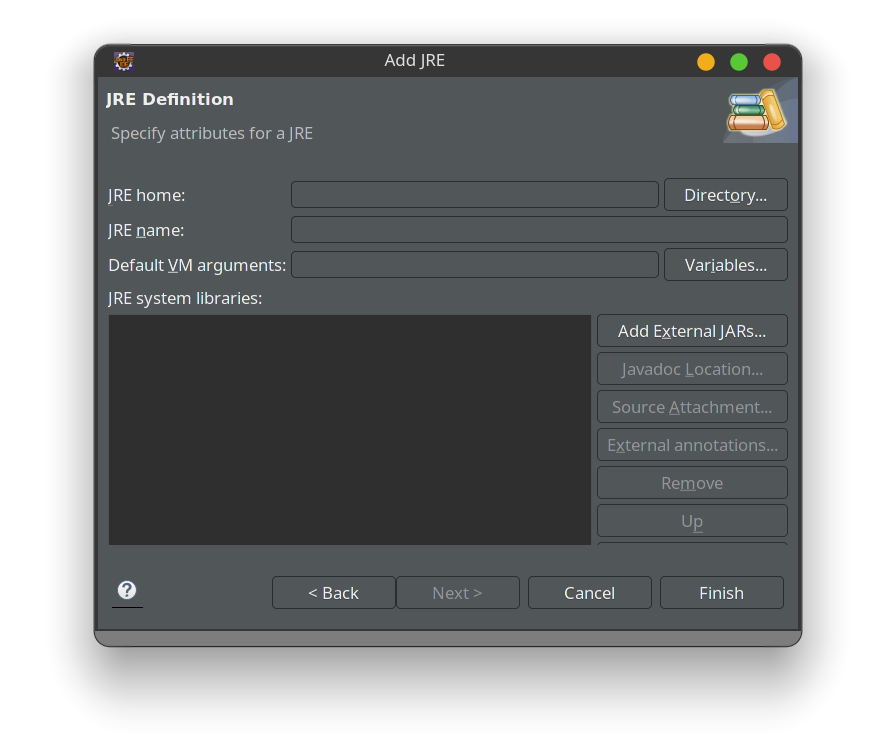

## Steps

- Open your project

- Go to Windows->Preferences

- Search for Installed JREs

- Remove your current installed JRE

- ### Note Make sure you have already installed Java 17 on your system

- The path shown is specifically for JRE installed in Arch Linux using AUR

- Click Add JRE. Then choose Standard VM.

- In the JRE home, choose the path lib/jvm/java-17-jdk then click finish

- Now you have successfully added java 17 to your Eclipse Project.
