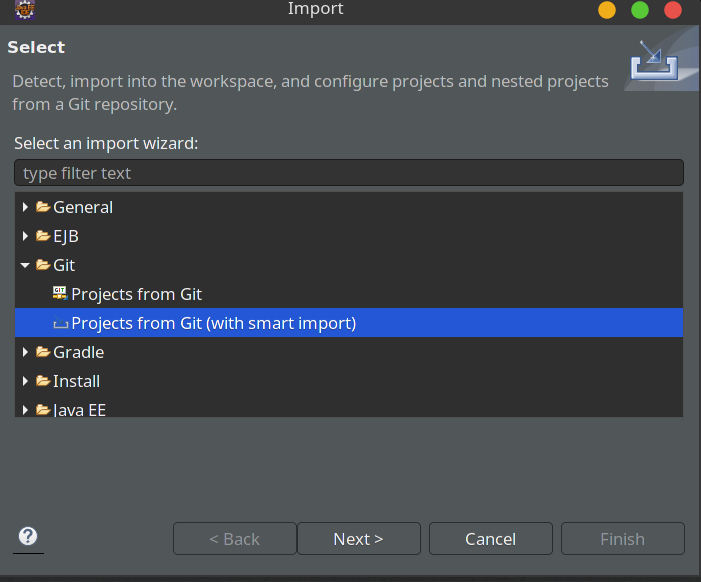
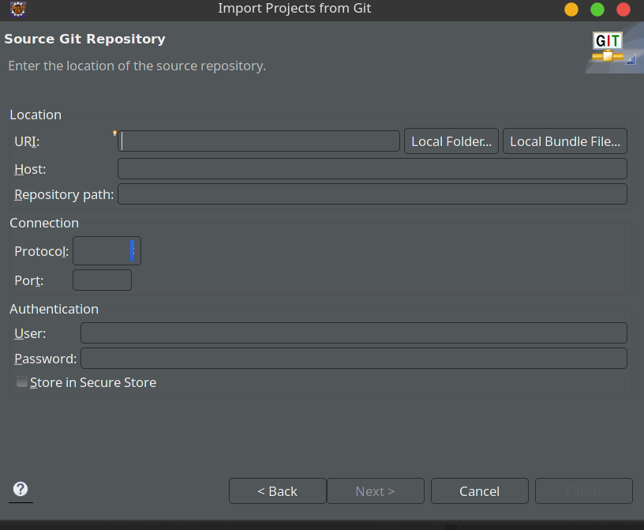
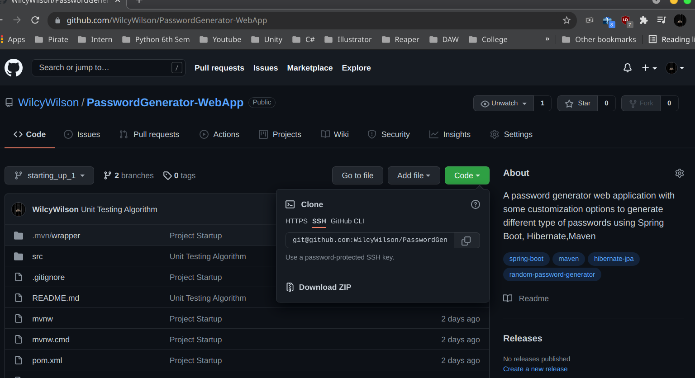
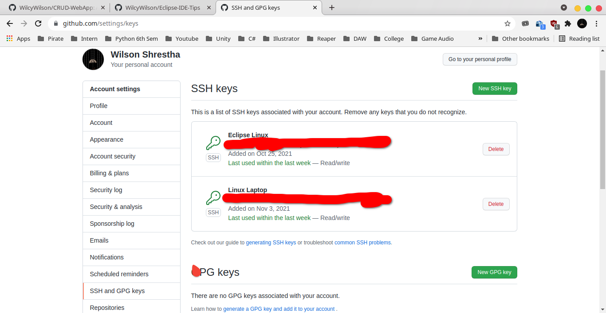
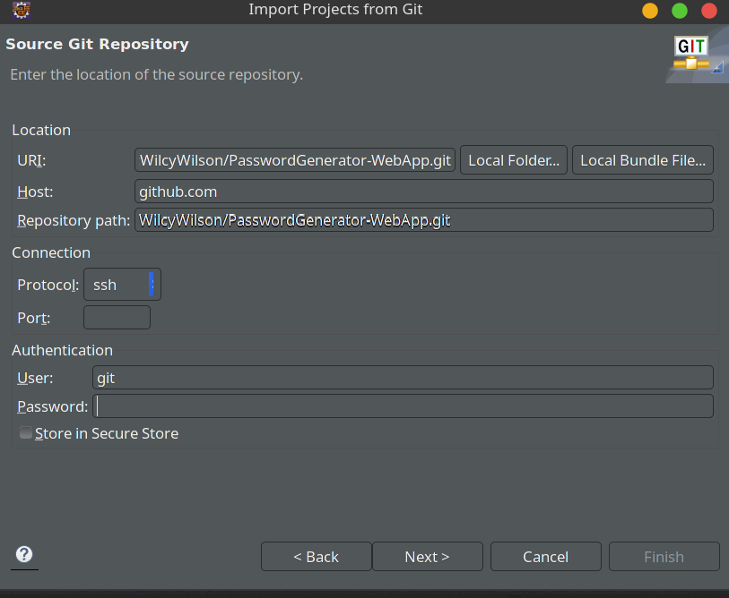

## Importing a Project from GitHub

### Note: Follow the previous [guide](https://github.com/WilcyWilson/Eclipse-IDE-Tips/tree/master/RegisterRSA#readme) to connect to our Github using SSH.  

- Go to File->Import in Eclipse IDE and choose projects with Git(with smart import)

- Click Clone URI

- Paste the SSH URI

- The SSH password is the blanked out red streak here from GitHub shown in the previous guide.

Note: The maven plugins takes sometime to download and setup once the project is imported. Be patient.