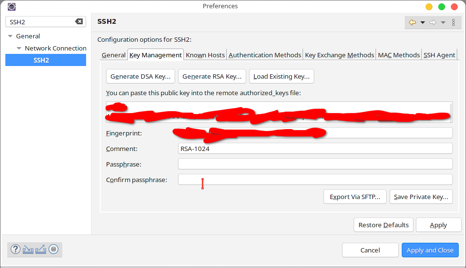
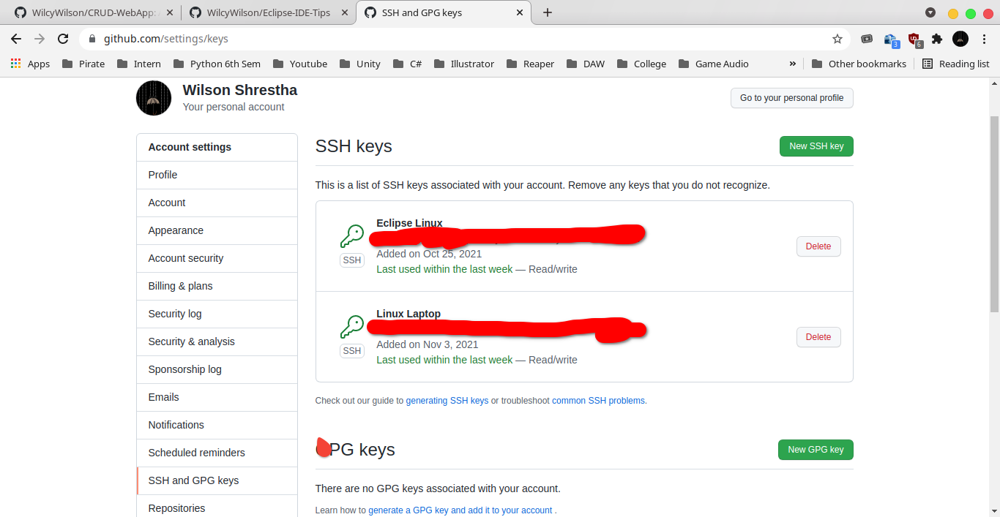
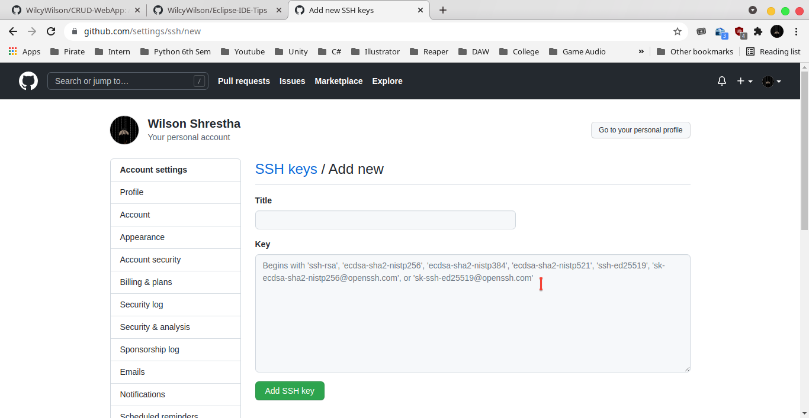

## Generating a RSA Key in Eclipse

- Go to Windows->Preferences and search for SSH2 in Eclipse IDE. 

- Click on generate RSA Key 

- Click on Save Private Keys to save the key to your system for future use. Info of where the key is saved is in General tab.

- Copy the RSA key like shown in above picture, not the Fingerprint or the Comment.

## Copying this RSA key to GitHub

- Go to Github->Settings->SSH and GPG Keys.

- Click on New SSH to add a new SSH key that you just copied from above Eclipse SSH2 Window.

- Give a title and paste the RSA key.

- Now your Eclipse SSH key is registered with your Github Account. And you will be able to import projects from your github account easily.

### Note: This uses SSH and not HTTPS so the import URI in Eclipse is going to be different and also     the password(key) to import projects is going to be shown like above picture after you register your new key which we will learn about later.